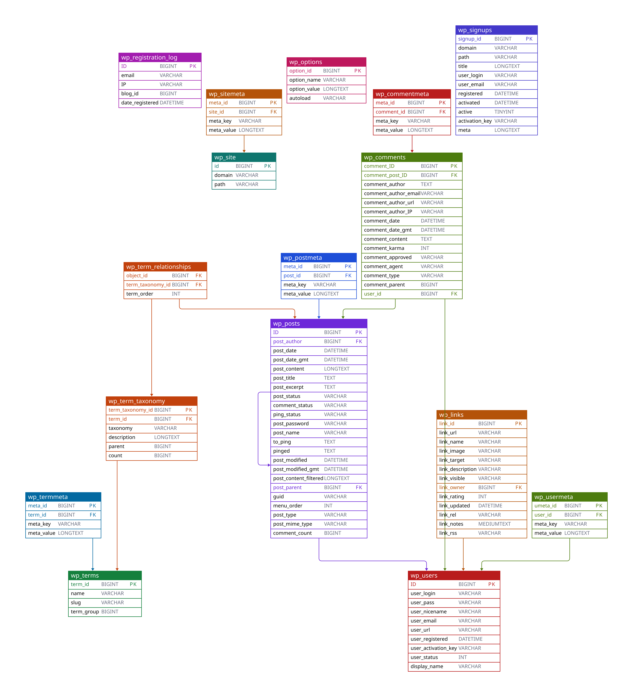
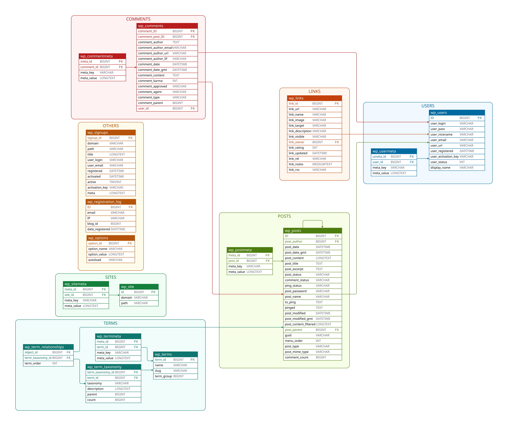
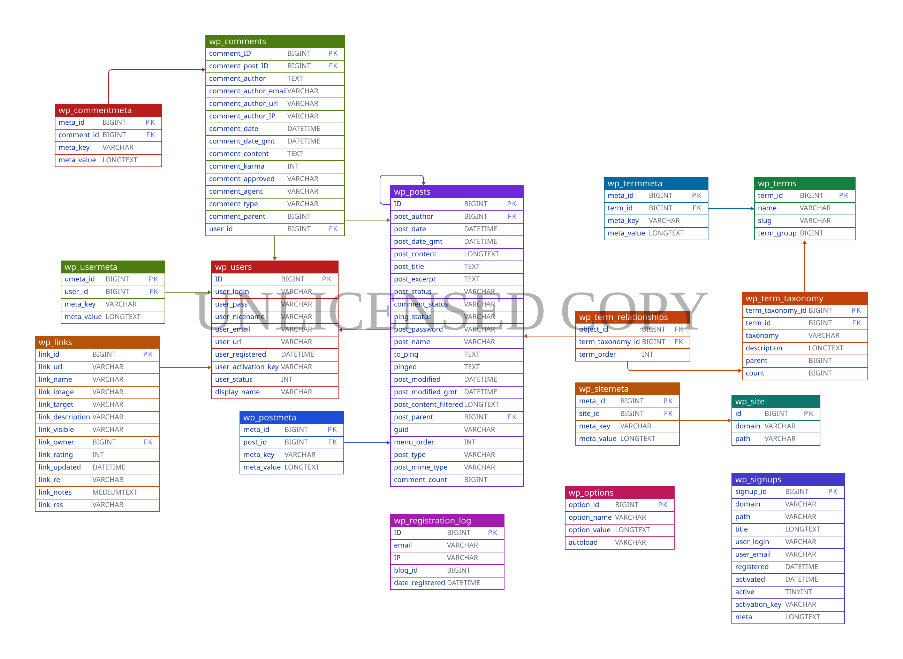
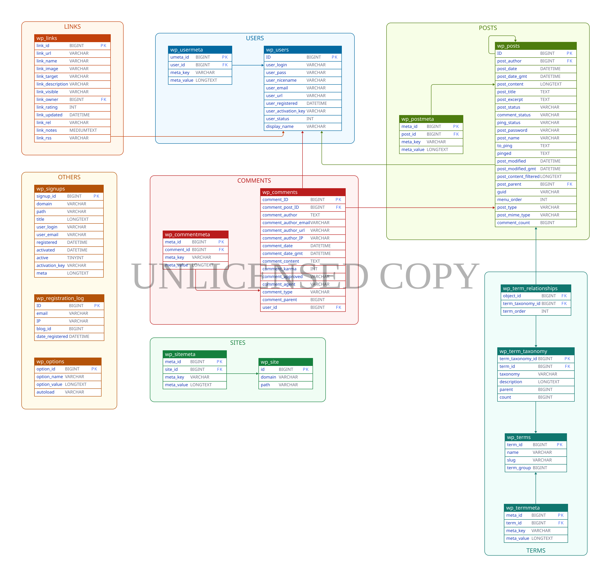

# SQLDiagram [![PayPal][paypal-badge]][paypal] [![Ko-fi][kofi-badge]][kofi]

SQLDiagram is CLI app to generate ERD from SQL files. It's inspired by service like [DBDiagram] or [DrawSQL] except its offline. It works by parsing your SQL files then convert it to ERD using [D2] diagramming language.

## Table of Contents

- [Table of Contents](#table-of-contents)
- [Installation](#installation)
- [Features](#features)
- [Limitations](#limitations)
- [Usage](#usage)
- [Examples](#examples)
  - [Basic Diagram](#basic-diagram)
  - [Grouped Diagrams](#grouped-diagrams)
  - [Using TALA Layout](#using-tala-layout)
- [Licenses](#licenses)

## Installation

If go already installed on your system, and `$GOBIN` is added to your `$PATH`, then you can install it by simply running:

```
go install -v github.com/RadhiFadlillah/sqldiagram
```

## Features

- Works offline.
- Has decent styling, thanks to D2.
- Directly parse SQL language so you don't have to learn a new diagramming language.
- Allow you to group tables in the diagram for better readability, by separating the SQL queries into several files.

## Limitations

- Currently only support MySQL dialect, so no PostgreSQL.
- Relations only drawn between table and not between columns, which is because of limitations in D2.
- Sometimes the relational lines will drawn above tables, which again is because of limitations in D2.
- The output is only in raw D2 language or SVG, so if you need PNG, you need to manually convert it.
- The relationship is only drawn as normal arrow.

Besides those point, SQLDiagram currently also only support limited DDL commands:

- `CREATE TABLE`
- `DROP TABLE`
- `ALTER TABLE DROP COLUMNS`
- `ALTER TABLE ADD COLUMNS`
- `ALTER TABLE RENAME COLUMNS`
- `ALTER TABLE CHANGE COLUMNS`
- `ALTER TABLE ADD CONSTRAINT`

## Usage

```
NAME:
   sqldiagram - generate ERD from SQL file(s) as SVG file

USAGE:
   sqldiagram command [command options] <input-1> ... <input-n>

COMMANDS:
   mysql    generate ERD from MySQL dialect
   help, h  Shows a list of commands or help for one command

GLOBAL OPTIONS:
   --help, -h  show help
```

Each commands has its own help, so you should check it as well. Here is the help for mysql command:

```
NAME:
   sqldiagram mysql - generate ERD from MySQL dialect

USAGE:
   sqldiagram mysql [command options] [arguments...]

OPTIONS:
   --no-group, --ng                don't render separate file as group (default: false)
   --raw-d2, --raw                 render as raw D2 scripts (default: false)
   --output value, -o value        write to specified path (if empty will use stdout)
   --direction value, --dir value  direction of chart (up|down|right|left, default right)
   --help, -h                      show help
```

By default it will print the output to stdout, so you could either redirect it:

```
sqldiagram mysql file.sql > erd.svg
```

or you can specify the output file:

```
sqldiagram mysql -o erd.svg file.sql
```

## Examples

### Basic Diagram

Here is the generated diagram for Wordpress database, taken from DrawSQL [template][DrawSQL-Wordpress]. To recreate it, download `wordpress.sql` in `example/basic`, then run:

```
sqldiagram --dir down wordpress.sql > erd.svg
```



### Grouped Diagrams

Here is the generated diagram for the same Wordpress database, but now is grouped. To recreate it, download directory `example/grouped`, then run:

```
sqldiagram --dir right grouped > erd.svg
```



### Using TALA Layout

Besides using the open source layout engine, D2 also has its own proprietary layout engine named [TALA]. In some case, it will give a better and prettier diagram than the open source engine. Unfortunately, its not free and it doesn't provide API to access it directly from Go language.

If you want to use it, you need to generate the layout in D2 language using `--raw` flag, then copy the result to D2 playground. Do note that you will miss some styling which we done manually in SVG because table styling in D2 is still lacking. For example, [here][play-wp-tala] is the diagram for Wordpress using TALA engine:



And [here][play-wp-tala-grouped] is the grouped diagram using TALA engine:



## Licenses

SQLDiagram is distributed under [MIT license][mit], which means you can use and modify it however you want. However, if you make an enhancement for it, if possible, please send a pull request. If you like this project, please consider donating to me either via [PayPal][paypal] or [Ko-Fi][kofi].

[paypal]: https://www.paypal.me/RadhiFadlillah
[paypal-badge]: https://img.shields.io/static/v1?label=&message=PayPal&color=00457C&logo=paypal&logoColor=white
[kofi]: https://ko-fi.com/radhifadlillah
[kofi-badge]: https://img.shields.io/static/v1?label=&message=Ko-fi&color=F16061&logo=ko-fi&logoColor=white
[DBDiagram]: https://dbdiagram.io
[DrawSQL]: https://drawsql.app/
[D2]: https://d2lang.com/
[DrawSQL-Wordpress]: https://drawsql.app/templates/wordpress
[TALA]: https://terrastruct.com/tala/
[play-wp-tala]: https://play.d2lang.com/?script=tFnNbuM2EL7rKYj0nMJ_yToqUCBtkq2BJi0WbtGeBFqkVTaSqFJUYmPrd1_wRxZJyTKZzR4CWDPUaIbz8ZsZRuc8Bp8jADJGm0r9BED60T4AYMElBrOJlpv-x2B2XJ2jGHDWYCk4ROqP4RwKLJ34xpAt9eohOuIwBkzkPYpeqySlRYFLXmAOlRWZpRjU_-UJh5tcfN36hgBhDC6-29xM02l6EXVfFdKHh4cL7akwmRAUg59WH1dPa_C5OxUxqBgpINsnz3gv1movTi7fUoZJVrbLpelnvI_Bn7effv7l9lMre4F5g2Pw629PH9f3f62jg4yRY1Yk7cbV_5CqDgs1nS2mk7FQ6eZfnHp7L93hcEdLWuyDXpIAisHqqY2sJhy_IXWLq_nk5p1SJ1z4RnnTqAjM1gJ9SCfbkehasK3ugrBZ0fr0O06g7TuwEewaAxmUK05wAUlu7oWjb9iYdvX7kBJBjmNwd7u-X68e7x1FkhV8UJnSkmMRh-PoM2QFVIAzvl9VjL5gNOhbJs30FXwvkteXV5DJN9SmRgA0NWZ-eOoOdyBCplfLyRyNIEQeNk_8l7CwAqvzJjOfpS1dFnSQ3dkN83uy_XB9jUf89nQZ0QKS0nSygqJctM_dxoZzy2R-fQOn78Qto3n4Om4Rpzk8uilaYLR8p-gkoXyb6GqSlU1omVvM58sUjgSnrPqGdw5lAHDCc9N3ffhzmtnvSWmPLBnOSM0xE0RkUBpMOXkRLXtfimOwXj39rXhGryO0HNrXQbwE7uc1mi3RWJn1LEASJ20l8cCKXN-rA0dprwhIzbECGNmQCp0kU4R3KWYVt4U1h1y0tX2K72sqUmZDYmGngnX9ShnqKVyi5TQRdjovSJmJrJtOFRSRLXGwYGlGdyPZklwjzN0Wu26N5iNrCLLxVTZmK9dutFMhlZukwCdrZ0obo3QqnKpTwRSwc5qFQRbOpikc6508Ids7rHazsslpZtCIIAsBzMETrcKilezdA_tcPF1ejdV5ZdWX0PRqF4da7BIxALDhNKcQuYVV0FloJOeGLc-8jPCrOHc9YUnEIG_HO8zGUuo0rFJ2gqal7jQHS3XLEBoipK5yuHf235jw2pHqnYc7v3HtKzqXzu8ufoTrlJFKTesm97jt8hAH5KR8DgXYuZFQ2PQNXq51sCBlLpSU0QJmfam6rumJrX1xdC-kJpu8b4q-ltivcsrlgjtFWVH7q2KpUK-jUGvxQJCU4zoGj_d3qz8eddrUYvOAdVQQ3oWenXCbkDbUf-B66wAvVoDLH4E90st7s_h4ofWDivX7LiBNeqfucLRF9-ifNasP_GHUatvu-Vszr2O0ET3hnQ9UHT770iPUEQ2Kw4CNtuD42zDnP2OfvYzoCdAes0Kj0YOW0XuHxqK774NrwNuFo4FegQndEQsjkpxDg7EQ0pLG27O72-0uNzRHlyVFQvX_hWQYfWs8jQBQ_xlQvy0O0hf8MZhE_ftmJbNurg_RIfoSAAD__w%3D%3D&layout=tala&
[play-wp-tala-grouped]: https://play.d2lang.com/?script=tFjbbuM2E773UxD5r3_DOWzSsECBdOPsCl07i8RbtFcCLVFaNpKoklSyxiLvXvCgI2lbku2LAPGMOMOZ-eZEE3MIfk4AiBktcv0vAOoe5Q8AWnCB4GJm6M37Q3BRfZ2EEAhWYEV4n-g_hhMksbRFh0uWPvo-qXAIAZNxnwQ0TXEmOAQfHxeL-XL1rOQog6A2ZdLRICEIwdn_IhxdRBdnk1qnpK5vz4PzQFNrULY58jZvuW90p1igyhSJDwj4v4kv0DrBLvtK_U1NzRs8PDycVUYDIMX7JITgd--Tt1yBn3VmQpAzkiK28V_wRn9t7rT1QEQZJnFWH1DiX_AGgj_vnj5-vnuqqa8oKTAEXx6Xn1bzv1aW4fyEVpd2ePcDDc8p337Ksr48hQpZQiAwdnYZPk4RSdou6nxRsN1876ubHSKBIbi_W81X3mJusfw4FVvYAc0EllZZl35BLEUQeMuOLXnO6CsOt9wzVsJcLLGR4XVxcsTUKe1sxSo4Zn3hJ1NaVmMOwRdv-ceA3I2iGxx2cze4uDqfOXO35hgIG63D8dvUsQO_Un7_rFVfWwhS1Ayl2EEmKYpddN0iHAzZxRnJde20uK-Ek3XiEkjfMsx6ZpM6wJAgWVyjT9uWSzCHHSTr77HTbCpkP1rM771viwrg-oBER31AYoiK75hxCB5Xn-dPg1C0xmurA1x9uJzdOjtAxTEo4iTOinxcHWxo2YEjraE_kkKaItKJcI5kI21SBBFJu7KbvE1o3D2t6I76x3BMuMDMiioKBHl1RFvRMQQrb_l3CQ7zLaGZuwe5uo9WzPSphMYn9H7v7uPwT7fgrxMaN-KooyUr_BZHGmupStlTQkxr6A8x871dmAzDHhsAQIWgCUVhN3Flt-YQfH18HjK43UQY33TT9iq8CWaRK21rjvGp0Trco00dx4CNGlbK2aNXiVUnHDNDRXcMDIpXTQutuCiWqQZtIv4RYJaLLpkLJAruHgZcvJxksZshpeWI8zfKQgfLhpegfq46S30jksUya9pXTGlIImKVnxZvj5f8iCQmI213tWeePfGKCxJ2y1pW-GqNqnukDoM1ZekrkxTvmMACWrQGsAbExy4mPVE-bDFRtpxqK3mfcKLmhWdvNR9QSGZRGF11C8n5h19ml6GrkNScqv8LPNbLTTVH87K80Gl3P6nhhOYeddCRwBCYpVyWiKfFQGCgLjBm0c31NXYBo-YYL0mtfvnOwb-TcTNiU-GuBr7-BwcDkktdTqAfNKPpZuCxVuFqGHtK-5Ti3sCwGwdPirjTSqRE887VrZySNzanexo0LKd3mn-UnG4B4tSB3Au8Ax1Q29F0QGv9bfd0-wnD7qnvE7kGcQi-PQ9aMGfRbRRZdeTy-hadO-tIxTGRMVpHRKSh4xiT6s7tMEecO8gZCbCdjdv2SUW33kAUdeuqqbi7dkj1QTl-VlsX4XmCNtaI2fD56ALQz-3FsAow5EltxOxUPudO22_a4P-_AQdLwtFgv2xwv2p3TK1XdKdsLgWrFWza2MUOF6lyZdpImv4i1WvgtHwWHCfMPAyanbYybZwwM4K7hA33nFtYGeID5Kmhe9qYg6W8FrGPODMZmlFt6pyepOA2u9Gu9mow7WmvhuGucEsuXdEiHiCvMvZAoS0clpccDk5T5N4n_wUAAP__&layout=tala&
[mit]: https://choosealicense.com/licenses/mit/
